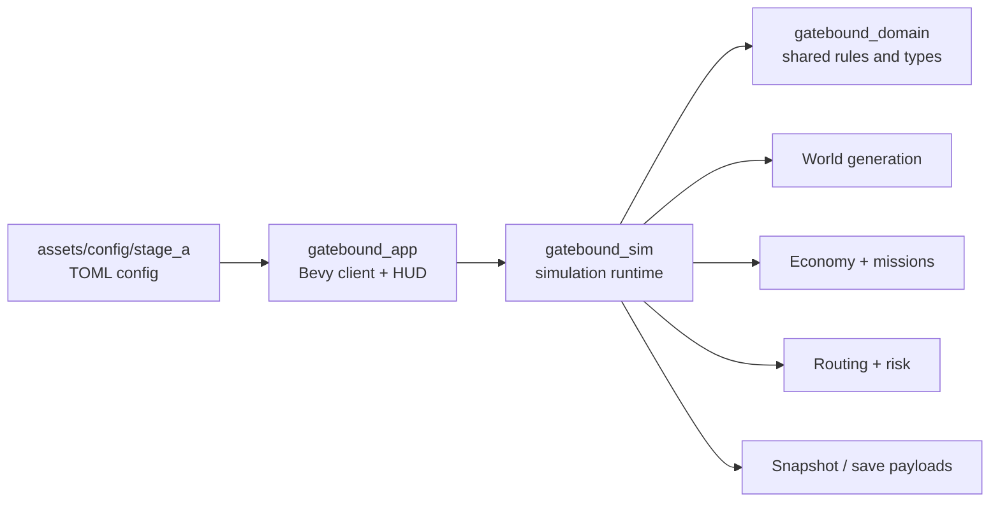

# Gatebound

*A frontier logistics sim about moving cargo through a living interstellar economy.*

Gatebound is a Rust + Bevy simulation game prototype set in the year 3500. You operate on the edge of a procedurally generated star network, chasing contracts, reading market stress, routing around congestion, and trying to stay solvent while the wider economy keeps moving without you.

> [!IMPORTANT]
> **Current status:** Gatebound is a **Stage A UI Slice**. It is a **work in progress** and a **playable simulation prototype**, not a content-complete commercial release. The current focus is on **routing, markets, missions, and fleet operations**.

> [!TIP]
> **Quick launch:** `cargo run -p gatebound_app`  
> **Quick verification:** `cargo test -q`

## Table of Contents

- [Project Status](#project-status)
- [What Is Gatebound?](#what-is-gatebound)
- [Why It's Interesting](#why-its-interesting)
- [Core Gameplay Loop](#core-gameplay-loop)
- [Feature Highlights](#feature-highlights)
- [Quick Start](#quick-start)
- [Controls](#controls)
- [Project Structure](#project-structure)
- [Simulation Overview](#simulation-overview)
- [Save System](#save-system)
- [Current Limitations / Stage Boundaries](#current-limitations--stage-boundaries)
- [Development Notes](#development-notes)
- [License](#license)

## Project Status

Gatebound currently ships as a desktop simulation slice built in a Rust workspace with three main crates:

- `gatebound_domain` for shared world, market, routing, fleet, and mission types
- `gatebound_sim` for the actual simulation rules and runtime state
- `gatebound_app` for the Bevy client and HUD-driven play experience

This version is already useful if you want to:

- explore a generated trade network
- run missions and spot cargo trades
- inspect shortages, surpluses, congestion, and risk pressure
- observe NPC logistics companies operating alongside the player
- test moment-to-moment game feel for a logistics-first strategy game

It is not yet positioned as a finished campaign, narrative sandbox, or full production release.

## What Is Gatebound?

Gatebound is a game about logistics as strategy.

You are not conquering planets or farming abstract resources from a spreadsheet. You are working inside a star-spanning transport network where stations want different goods, gates can become congested, prices react to pressure, contracts expire, and your choices matter because the simulation keeps advancing whether you are ready or not.

In this Stage A build, the fantasy is simple and strong:

- take freight work across a frontier economy
- move ore, ice, gas, metal, fuel, parts, and electronics where they are needed
- watch systems fall into stress and recover
- route around delays and risk
- manage capital, debt, and reputation while building operational control

## Why It's Interesting

Gatebound is compelling because it treats logistics as a readable, playable system rather than invisible background math.

- **Living economy:** prices, stock coverage, inflow, and outflow shift across the network instead of staying static
- **Visible supply-chain stress:** the UI exposes hotspots, anomalies, congestion, and shortage signals so the economy can be read, not guessed
- **Routing under pressure:** distance is only part of the problem; queue pressure, gate disruption, and route risk shape good decisions
- **Emergent stories:** profitable runs, last-minute deliveries, and overloaded corridors naturally produce "I barely made that work" moments
- **Hands-on strategy:** the prototype already supports a satisfying loop of observing, deciding, executing, and adapting

## Core Gameplay Loop

1. Scan the galaxy and identify stressed systems, price spreads, and contract opportunities.
2. Zoom into a system, inspect stations, and decide whether to run a mission or trade spot cargo.
3. Launch your ship into the network and watch ETA, route length, queue exposure, and cargo status.
4. React to the economy as it changes: stations drift into shortage, gates clog up, and opportunities move.
5. Manage debt, reputation, and milestone progress while trying to keep your operation efficient.
6. Use the dashboards to learn where the simulation is tightening or opening up, then plan the next move.

## Feature Highlights

- **Procedural galaxy generation** with a 25-system Stage A map
- **Five competing frontier factions** with distinct territory ownership
- **Three station profiles**: `Civilian`, `Industrial`, and `Research`
- **Seven trade commodities**: `Ore`, `Ice`, `Gas`, `Metal`, `Fuel`, `Parts`, `Electronics`
- **Mission contracts** for transport work with route, ETA, reward, and penalty data
- **Player-operated ship gameplay** with route, cargo, modules, and technical state views
- **NPC logistics companies** that move freight through the same world
- **Market dashboards** for price index, stock coverage, hotspots, anomaly rows, and system stress
- **Finance systems** including loans, debt tracking, and reputation pressure
- **Milestones** for capital, market share, throughput control, and reputation
- **Save/load support** for desktop play sessions
- **Debug risk events** for gate congestion, dock congestion, and fuel shock testing

## Quick Start

> [!TIP]
> The fastest path is: install Rust, clone the repo, run the Bevy app, then use the controls table below to start exploring systems and stations.

### Requirements

- Rust toolchain with `cargo`
- A desktop environment capable of running a Bevy application

### Run The Game

From the repository root:

```bash
cargo run -p gatebound_app
```

### Run The Test Suite

```bash
cargo test -q
```

### Run Full Quality Checks

```bash
cargo fmt --all -- --check
cargo clippy --all-targets --all-features -- -D warnings
cargo test -q
```

### Stage A Configuration

Runtime configuration is loaded from:

```text
assets/config/stage_a
```

This directory contains the Stage A configuration for:

- galaxy generation
- time units
- market behavior
- economy pressure and milestone thresholds

## Controls

| Action | Binding | Notes |
| --- | --- | --- |
| Pause / resume simulation | `Space` | Toggle time flow |
| Set simulation speed | `1`, `2`, `4` | Switch speed multiplier |
| Open Missions panel | `F1` | Contracts and active mission state |
| Open MyShip panel | `F2` | Ship status, cargo, modules, technical state |
| Open Markets panel | `F3` | Market dashboards and commodity intelligence |
| Open Finance panel | `F4` | Capital, debt, and loan state |
| Open Policies panel | `F5` | Player-facing policy controls |
| Open Station panel | `F6` | Station interaction, trade, storage, missions |
| Open Corporations panel | `F7` | NPC company overview |
| Open Systems panel | `F8` | System-level operational summary |
| Cycle selected player ship | `[` and `]` | Step through available player ships |
| Inject gate congestion | `G` | Debug risk event |
| Inject dock congestion | `D` | Debug risk event |
| Inject fuel shock | `F` | Debug risk event |
| Zoom galaxy view | Mouse wheel or `+` / `-` | Active in galaxy mode |
| Select system | Left click | In galaxy view |
| Open system view | Double-click system | In galaxy view |
| Select station | Left click | In system view |
| Open station or ship context | Right click | In system view |
| Pan galaxy camera | Right-drag | In galaxy view |
| Open save menu | `Esc` | Save/load interface |

## Project Structure

| Crate | Role |
| --- | --- |
| `gatebound_domain` | Shared domain model: world generation, cargo, routing, missions, companies, markets, and identifiers |
| `gatebound_sim` | Simulation engine: economy flow, routing, missions, risk events, storage, milestone tracking, and query views |
| `gatebound_app` | Bevy client: rendering, input handling, HUD panels, save UI, and runtime wiring |



## Simulation Overview

Gatebound Stage A currently simulates:

- **Year:** `3500`
- **Galaxy size:** `25` systems
- **Faction set:** `Aegis Collective`, `Cinder Consortium`, `Verdant League`, `Helix Syndicate`, `Solar Union`
- **Station profiles:** `Civilian`, `Industrial`, `Research`
- **Commodity set:** `Ore`, `Ice`, `Gas`, `Metal`, `Fuel`, `Parts`, `Electronics`
- **Pressure signals:** price index, stock coverage, net flow, congestion, fuel stress, anomaly score
- **Economy actors:** player operation plus multiple NPC logistics companies

The simulation already exposes operational views that make it practical to reason about:

- which systems are under stress
- where goods are below target
- where prices diverge from the galaxy average
- which routes are becoming congested
- how missions and freight activity interact with the wider network

## Save System

On desktop, the game includes a save/load flow behind the `Esc` menu.

By default, save data is written to a local `saves/` directory located next to the executable. If that location cannot be resolved, the runtime falls back to a `saves/` directory under the current working directory.

The current save format is JSON-backed and stores:

- a save manifest
- per-save payloads
- core simulation state such as time, economy, ships, missions, and progression metrics

## Current Limitations / Stage Boundaries

> [!CAUTION]
> Gatebound is intentionally narrow right now. The project already contains a strong simulation core and useful UI, but this is still a scoped prototype slice.

Current boundaries to be explicit about:

- desktop-first Bevy application, not a packaged storefront release
- no claim of content-complete campaign play
- no large-scale content pipeline, faction diplomacy layer, or narrative progression system yet
- no public CI/documentation site surfaced from this repository
- focus remains on logistics readability, economy behavior, route pressure, and operator-facing tooling

That constraint is deliberate. The current build is meant to make the core loop legible and worth expanding.

## Development Notes

If you want to work on the project as a contributor or collaborator, start with the workspace root and use the existing Rust tooling.

### Useful Commands

```bash
# run the Bevy client
cargo run -p gatebound_app

# run the workspace tests
cargo test -q
```

### Where To Look First

- `assets/config/stage_a` for simulation tuning
- `crates/gatebound_domain` for shared simulation concepts and identifiers
- `crates/gatebound_sim` for economy, routing, missions, storage, and query layers
- `crates/gatebound_app` for rendering, input, HUD panels, and runtime orchestration

### Design Direction In This Build

The current codebase is clearly oriented toward:

- readable simulation state instead of hidden systems
- UI panels that explain what the world is doing
- operational decision-making over abstract empire management
- expanding from a solid simulation slice rather than from placeholder presentation

## License

This workspace is licensed under the **MIT License**.
